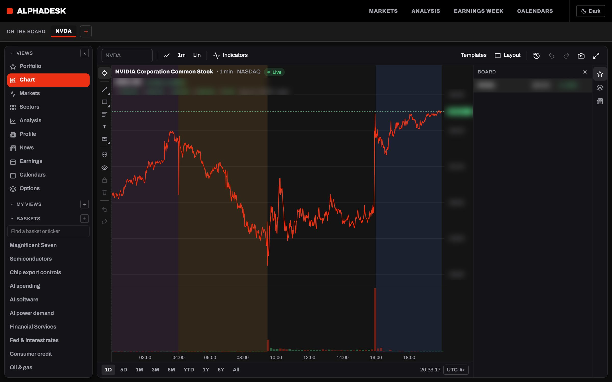
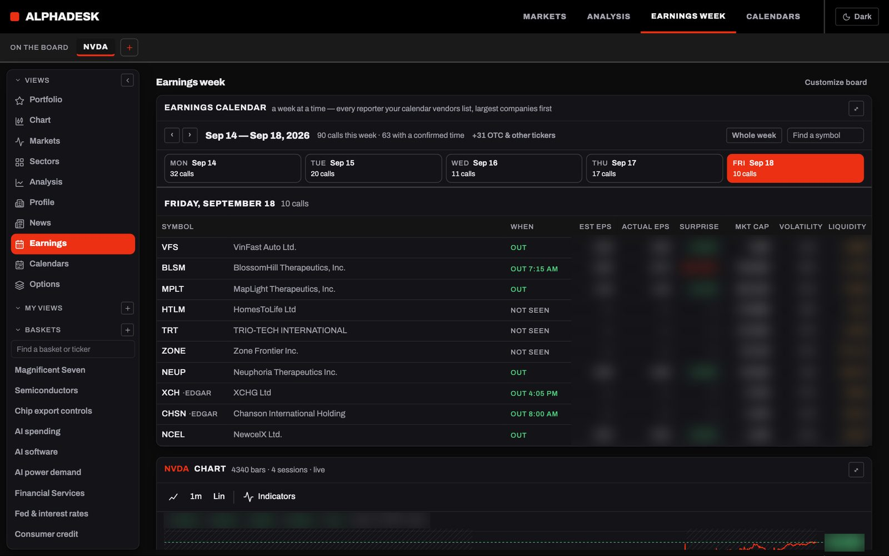
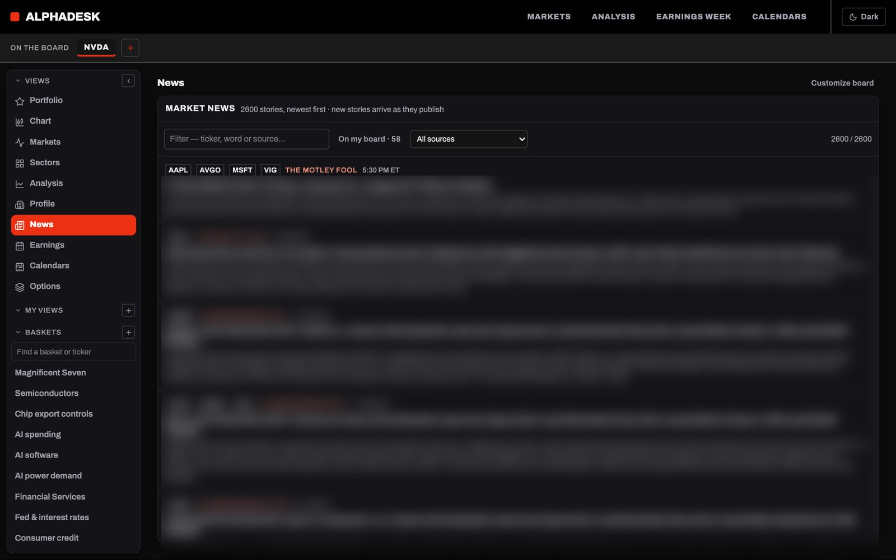
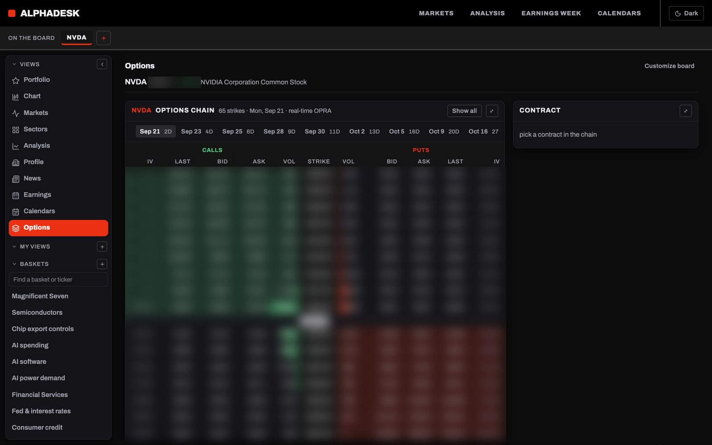

<!-- mcp-name: io.github.vigneshv1cky/alphadesk-terminal -->

# AlphaDesk — dense, fast market-research terminal & MCP integration platform

[](https://pypi.org/project/alphadesk/)
[](LICENSE)
[](#licence)


**A dense, fast market-research terminal and integration platform.** Readers
connect their own market-data and news providers; AlphaDesk is the workspace
that connects, checks and presents what those providers — and the public
record at SEC EDGAR and the US Treasury — actually say. Questions are asked
in the reader's **own AI agent** (Claude, ChatGPT, Codex, Cursor, opencode),
which reads the same records through **53 read-only agent tools** (MCP).

AlphaDesk **reads**: quotes and charts, news, SEC filings, financial
statements, ownership and insider activity, earnings and corporate
calendars, options. It covers **US equities only**: no cryptocurrency. It **does not** trade, route orders, hold
positions, score ideas or write summaries.

Two ways to use it — the [managed cloud](#option-a--managed-cloud) or
[your own server](#option-b--self-hosted-agpl-30). The code is open source
under the **GNU AGPL-3.0**, with a **commercial licence** for anyone who
cannot meet its terms. See [Licence](#licence).


<sub>Figures in every screenshot are blurred on purpose: they came from a
reader's own vendor keys, and vendors restrict public display of their
data. The layout is the real thing.</sub>

| | |
|---|---|
|  |  |
| **Chart** — your own SVG engine, session bands, drawings | **Earnings week** — dated by the company's own release and its SEC filing |
|  |  |
| **News** — your feeds in one three-day window, searched by word or meaning | **Options** — chains by expiry, calls and puts either side of the price |

## Quick start — run it yourself, for one person

You need Python 3.11+ (or Docker; where a command below says `python` and your shell
only knows `python3`, use that, or the virtual environment's own `python`), and your own market-data and news keys for
anything beyond SEC EDGAR and Treasury data. No account, no sign-in, no
database to set up.

```bash
pip install alphadesk
```

```bash
python -m alphadesk.main init --email you@example.com
```

```bash
python -m alphadesk.main dashboard
```

Open http://127.0.0.1:8000, then connect your vendors on the **Account**
page and your agent on **Agent access**. `init` runs once: it makes the
settings file `~/.alphadesk/.env` (owner-only) holding a vault key that seals
your stored vendor keys, the contact address the SEC asks for, and
single-person mode. **Keep a copy of that file** — without the vault key the
stored vendor keys cannot be opened. The server listens on this machine only.

**To run exactly what the cloud runs** — Postgres and a login of your own, instead of
SQLite and no sign-in — set it up with `--like-cloud`. It asks for a password
(type it in a terminal; it is never printed), makes the settings file with a
password hash, and creates the Postgres database if the server is running:

```bash
brew install postgresql@16 && brew services start postgresql@16
```

```bash
python -m alphadesk.main init --email you@example.com --like-cloud
```

Then `python -m alphadesk.main dashboard` as above, and sign in with that email and
password. Use `--login` for a different login email, `--database-url` for another
Postgres, and `--password-hash` (from `python -m alphadesk.main hash-password`)
to skip the prompt. For a setup with no typing at all, for example from a script:

```bash
python -m alphadesk.main init --email you@example.com --like-cloud --password-hash "$HASH" --database-url postgresql://localhost:5432/alphadesk
```

What to know about the Postgres path:

- **Version.** It is built and run against Postgres 16. The driver is a pure-Python
  one that comes with the install, so there is nothing to compile.
- **The database.** `init --like-cloud` creates the database if the server is running and
  the user may create databases. If it cannot, it still writes the settings and prints
  what to do, usually `createdb alphadesk` (or start Postgres first). Tables are created
  at the first start, and starting again is safe.
- **The word-search index.** The first start also tries to create the `pg_trgm`
  extension and the indexes that make word search fast. If the database user may not
  create extensions (some managed services), the log says so once and search still
  works, only without the index. Ask the service to allow `pg_trgm`, or run
  `CREATE EXTENSION pg_trgm` as an administrator, and restart.
- **Moving from SQLite.** The two stores are separate: switching an existing setup to
  Postgres starts with an empty ledger. Your vendor keys sealed in the old store are not
  carried over, so keep the settings file and add the keys again on the Account page,
  or import them with `python -m alphadesk.main keys import-file`.
- **Backups.** The ledger is one database: back it up with `pg_dump`. Keep the vault key
  in the settings file as well, because stored vendor keys cannot be opened without it.

With Docker instead:

```bash
ALPHADESK_CONTACT_EMAIL=you@example.com docker compose up -d
```

The first start does the same setup inside a data volume and keeps it there. It
also starts Postgres beside the app, the same database the live server runs, so
what you test locally is what runs in the cloud; the word search uses a Postgres
index there that SQLite cannot have.

What to know about the Docker path:

- **The first build is large and slow.** The image holds Python, a CPU-only build of
  the machine-learning library and the 1.2 GB embedding model that search by meaning
  uses, baked in so a starting container fetches nothing. Expect several gigabytes and
  a long first build. `ALPHADESK_SEMANTIC_SEARCH=off` stops the model being loaded when
  the app runs; it does not shrink the image.
- **Two volumes hold everything.** `alphadesk-data` has the settings file (with the
  vault key) and `alphadesk-pg` has the database. `docker compose down` keeps both;
  `docker compose down -v` deletes them and with them your history and stored keys.
- **Back up the settings file.** `docker compose cp alphadesk:/data/.env ./alphadesk.env`
  copies it out. Without the vault key the stored vendor keys cannot be opened.
- **Update.** `git pull`, then `docker compose up -d --build`. Settings and data stay.
  Watch it with `docker compose logs -f alphadesk`.
- **No sign-in inside the container.** It runs in single-person mode on
  `127.0.0.1:8000`, as above. For a login of your own use the host setup with
  `--like-cloud`, or put an access token in front as described below.
- **Agents.** Create the token on the **Agent access** page as usual; the tools answer on
  `http://127.0.0.1:8000/api/agent/tools/mcp`. To reach them from another machine, set
  `ALPHADESK_BASE_URL` to the address that machine uses and
  `ALPHADESK_ALLOWED_HOSTS` for any other name, and keep an access token in front.
**Reachable from other machines?** Sign-in is off in this mode, so anyone who
can reach the port can use it and read your connected vendors. Keep it on
`127.0.0.1`, or set an access token — the browser then asks for it once, and
agents keep using the tokens you make on **Agent access**:

```bash
python -c "import secrets; print(secrets.token_urlsafe(24))"
```

Put the result in `~/.alphadesk/.env` as `ALPHADESK_ACCESS_TOKEN=...` (with
Docker, pass it as an environment variable) and restart. Over the internet,
put HTTPS in front of it.

Other ways to run it, serving other people, and every setting are under
[Two ways to run it](#two-ways-to-run-it) and
[Configuration reference](#configuration-reference).

---

## Contents

1. [What AlphaDesk is — and is not](#what-alphadesk-is--and-is-not)
2. [Two ways to run it](#two-ways-to-run-it)
3. [Design principles](#design-principles)
4. [Features](#features)
5. [Data sources](#data-sources)
6. [Search](#search)
7. [Agent access (MCP)](#agent-access-mcp)
8. [Accounts, security and privacy](#accounts-security-and-privacy)
9. [Architecture](#architecture)
10. [Repository layout](#repository-layout)
11. [Development](#development)
12. [Configuration reference](#configuration-reference)
13. [Production deployment and operations](#production-deployment-and-operations)
14. [Testing and quality](#testing-and-quality)
15. [Known limitations](#known-limitations)
16. [History](#history)
17. [Licence](#licence)

---

## What AlphaDesk is — and is not

| AlphaDesk is | AlphaDesk is not |
|---|---|
| A **consumption terminal**: it fetches, checks and presents market information | A trading system — there is no order routing, position state or broker integration |
| An **integration platform**: every vendor figure runs on the reader's own key | An aggregator — the server holds no vendor keys and never shares one reader's data with another |
| A **presenter of records**: filings, statements, stories and prices, shown whole with their source | A summariser — no model writes, paraphrases or scores anything here |
| **Pluggable**: news feeds, market data, transcripts and dashboard tiles are swappable providers | A black box — every list is chronological, alphabetical or ordered by the figure it shows |

It is offered **free** at present (payments are designed but switched off;
see [Accounts](#accounts-security-and-privacy)).

---

## Two ways to run it

| | Option A — Managed cloud | Option B — Self-hosted |
|---|---|---|
| Price | **Free during early access.** Planned: $19 a month or $190 a year, announced before it starts | Free |
| Licence | Commercial terms of service — no AGPL obligations for you | GNU AGPL-3.0 |
| You run | Nothing: sign in with the login its operator set | One container or one Python process, and a database |
| Search by meaning | Included (the embedding model runs on our servers) | Runs on your CPU (~1.2 GB model, 2 vCPU / 4 GiB recommended) or switched off |
| Vendor keys | Your own, connected on the Account page | Your own, in `.env` or the Account page |
| Updates | Continuous | `git pull` and restart |

### Option A — Managed cloud

1. Open the [hosted terminal](https://alphadesk-764298799571.us-east4.run.app)
   and sign in with the email and password its operator set. There is one
   user per server and no sign-up.
2. On the **Account** page, connect the market-data and news providers you
   already use (Alpaca, FMP, Finnhub, Polygon, Alpha Vantage, …). SEC
   EDGAR and the US Treasury need no key.
3. Optional: connect your own agent from the **Agent access** page (in the
   sidebar, beside Account) — a token for Claude Code, Codex, Cursor or
   opencode, or add the server URL as a connector in Claude.ai or ChatGPT.

### Option B — Self-hosted (AGPL-3.0)

**You need** a SEC User-Agent with real contact details (SEC blocks
requests without one), Python 3.11+ or Docker, and — for anything beyond
EDGAR and Treasury data — your own vendor keys.

**1. Configure.** Copy the template and fill in the two required values:

```bash
cp alphadesk/deploy/env.example .env
```

| Setting in `.env` | Required | What to put |
|---|---|---|
| `ALPHADESK_VAULT_KEY` | yes | 32 random bytes, base64 — seals stored vendor keys; keep a copy, losing it makes them unreadable |
| `SEC_USER_AGENT` | yes | `AlphaDesk (you@example.com)` — a name and a real email |
| `ALPHADESK_AUTH` | for one person | `off`: a single local account with no sign-in |
| `ALPHADESK_ACCESS_TOKEN` | if reachable beyond your machine | with sign-in off, one shared secret (16+ characters) the browser asks for once; see Quick start |
| `ALPHADESK_DATABASE_URL` | no | a `postgresql://` URL (recommended: the Docker setup and `init --like-cloud` use one, and it enables the word-search index, which needs the `pg_trgm` extension); unset, SQLite in `ALPHADESK_DATA` (`~/.alphadesk`) |
| `ALPACA_API_KEY`, `ALPACA_SECRET_KEY`, `FMP_API_KEY`, `FINNHUB_API_KEY`, `POLYGON_API_KEY`, `ALPHAVANTAGE_API_KEY` | no | your own keys. Found at start, they are sealed into your account — the local one with sign-in off, or the login's — so the settings file is the record: they add or update keys, never delete them, and win over a key changed on the Account page at the next start. You can still connect keys on the Account page instead |
| `ALPHADESK_SEMANTIC_SEARCH` | no | `off` skips the ~1.2 GB embedding model; search then matches words only. Without the `search` extra installed it is off anyway |
| `ALPHADESK_LOGIN_EMAIL` + `ALPHADESK_LOGIN_PASSWORD_HASH` | no | with sign-in on: your own sign-in, and the only user the server accepts. With sign-in on it is required; the server will not start without it. At start the account is made, or an existing account with that email gets the password and keeps its data. While set, the password form is the only door. Make the hash with `python -m alphadesk.main hash-password`; `ALPHADESK_LOGIN_PASSWORD` (12+ characters) also works but is readable to anyone who can read the settings. The identifier is an email address |

Generate the vault key with:

```bash
python -c "import os, base64; print(base64.b64encode(os.urandom(32)).decode())"
```

**2a. Install from PyPI** — the shortest route; the built interface ships
with the package:

```bash
pip install alphadesk
```

```bash
python -m alphadesk.main dashboard
```

The terminal is at http://127.0.0.1:8000. This install is small and quick and
searches news by words. For search by meaning too, install the extra
(`pip install "alphadesk[search]"`, about a gigabyte of PyTorch); the first start
then downloads a 1.2 GB model into the Hugging Face cache.

**2b. Or run from a clone**, which is what you want if you intend to change
anything:

```bash
pip install -r requirements.txt
python -m alphadesk.main keys import-env
python -m alphadesk.main dashboard
```

**2c. Or run with Docker.** The image bakes the embedding model in, so a
container downloads nothing at start:

```bash
docker build -t alphadesk .
```

```bash
docker run -d --name alphadesk -p 8000:8000 --env-file .env -e ALPHADESK_DATA=/data -v alphadesk-data:/data alphadesk
```

With `ALPHADESK_AUTH` left on, set your login in `.env` (an email and a
password hash from `python -m alphadesk.main hash-password`); the server will
not start with sign-in on and no login set.

**3. Keep it private or publish your changes.** Under the AGPL, if you let
other people use a modified copy over a network, you must offer them the
source of your version. Using it yourself, unmodified, or keeping your
changes to yourself on your own machine carries no such obligation.

---

## Design principles

These are the product. Much of what might look missing was built,
measured and removed on purpose — **[DECISIONS.md](DECISIONS.md)** says what
and why. Bring evidence and open an issue.

1. **Nothing is paraphrased.** Every panel and agent tool returns what a
   vendor or EDGAR actually said — a filing in pages, a statement series, a
   story's own text. If a figure cannot be shown with its source, it is not
   shown.
2. **Indicators hide when the data cannot support them.** Bar coverage and
   gap size are measured per series; below the floor RSI and MACD are hidden
   rather than drawn over sparse prints that would render identically to a
   liquid name's chart.
3. **Nothing is ranked for you.** The screener window is alphabetical;
   calendars and agent tools order only by the figure on each row. Search
   results are newest first — a model may decide what is *related*, never
   what comes first.
4. **An idle terminal spends nothing.** Background loops fetch only public
   data and each reader's own news; everything else is fetched on request,
   on the requesting reader's keys.
5. **Untrusted text stays untrusted.** Headlines, articles, filings and
   transcripts are data. Nothing here acts on them, and the agent tools that
   return them say so.
6. **Not an aggregator.** Merging several news feeds is the reader's act, on
   their own credentials, for their own window.
7. **The agent surface is read-only and per reader.** Every agent call runs
   as exactly the reader whose token or grant it carries.
8. **Vendor data is the reader's.** No vendor key on the server; no keyless
   route to a commercial vendor or unofficial endpoint; every vendor cache
   keyed by reader; vendor data kept only as long as a feature reads it.

---

## Features

### Pages

| Page | What it shows |
|---|---|
| **Landing** (`/`) | Product overview with blurred screenshots; sign-in |
| **Markets** | A composable board: chart, equity overview, funds built on the stock, stock/ETF/currency/option movers, Treasury yields, heatmap, news. Stock and ETF movers **step back to a past session**, computed from the whole market that day against the session before it |
| **Chart** | Full workspace: candles, line, area, step and other styles; 1-minute to multi-year intervals; indicators and templates; drawing tools (desktop, per visit); multi-chart layouts; overnight, pre-market, after-hours and weekend session shading |
| **Analysis** | One name end to end: chart, filings, price performance, key statistics, earnings history and consensus, analysts, rating changes, financials as filed, splits, dividends, institutional and insider ownership, news. Funds add holdings and breakdown |
| **Profile** | Who a company is: EDGAR registrant facts, the latest 10-K/20-F business and properties sections verbatim, locations, officers |
| **News** | Each reader's merged feeds, three days deep, newest first; filter by words, source or board; search by words and by meaning; an in-page reader with full text where the feed carries it |
| **Earnings** | The week's reporters, dated by the company's own release and joined to its SEC results filing; sessions predicted from history; estimates, actuals, surprise, market cap, volatility, liquidity |
| **Calendars** | Economic releases, dividends, corroborated splits and IPOs |
| **Options** | Chains with implied volatility, calls green and puts red; options flow seen live |
| **Sectors** | Sector funds by weight and dollars traded, with breadth |
| **Baskets** | 36 curated baskets grouped by the *news* that moves them (rates, oil, tariffs, chip export rules, bitcoin, …), plus the reader's own |
| **Portfolio / custom views** | The reader's saved boards |
| **Account** | Coverage matrix of connected vendors and feeds (with the plain-text **Export keys** download) and sessions |
| **Agent access** | Its own page: connect an AI assistant (Claude.ai, ChatGPT) by address, make tokens for programs — each optionally tied to the addresses it may be used from — and ready-to-paste setup for Claude Code, Codex, Cursor, opencode or your own program over the data API |
| **Terms, Privacy, Disclaimer** | Public drafts pending legal review |

### Across the terminal

- **The symbol strip** scopes every page; picking a row adds and selects the
  symbol without moving the page.
- **Composable boards**: show, hide, reorder, size and place tiles; the
  layout lives in the URL, so a link restores the exact board.
- **Live data** where the reader's plan streams it (Alpaca stock and
  news sockets), polling elsewhere; a 428 prompt names the vendors and plans
  that would fill any panel the reader's keys cannot.
- **Phones**: every page is laid out for a 375-pixel screen as well as a
  desktop.
- **Light and dark themes**, a hand-rolled design system on a 4-pixel grid
  with six type roles, and full keyboard focus handling in every overlay.

---

## Data sources

### Market data — the reader's own keys

| Vendor | Carries (plan-dependent) |
|---|---|
| **Alpaca** | Consolidated (SIP) and IEX bars, overnight (Blue Ocean) session, quotes, movers, option chains with IV, options flow, corporate actions |
| **Financial Modeling Prep** | Calendars (earnings, economic, dividends, splits, IPOs), key statistics, profiles, analysts, market caps, currencies, press releases, fund data |
| **Polygon (Massive)** | Bars, quotes, movers, currencies, options |
| **Finnhub** | Company metrics, profiles, earnings calendar and sessions |
| **Alpha Vantage** | Company overview, bars |

For each panel the reader's connected vendors are asked in a fixed,
documented order; the first that carries the figure answers. Charts and
option chains are pinned to **one** vendor, never stitched across tapes.

### News — the reader's own feeds

Alpaca (Benzinga), Polygon, Finnhub, Benzinga, Alpha Vantage,
Marketaux and FMP. Several feeds merge into one window per reader,
de-duplicated by URL. Alpaca's news streams live; the rest poll every five
minutes.

### Sources with no key — read, not licensed

Three sources need no key because there is nothing to buy: the reader turns
each on with a button on the Account page.

| Source | Carries |
|---|---|
| **Nasdaq** | Earnings, dividend, split and listing calendars — and **today's trading halts**, which no vendor in the catalogue carries at all |
| **Yahoo** | Charts, quotes and daily history from the public chart endpoint |
| **Social** | One public account's posts, read from a public copy of the account. Only text posts are served, and every post seen is kept in an archive, so a search reaches back past the copy's newest hundred |

Two rules keep them honest. **A keyed vendor is always asked first** — every
licensed vendor is ordered ahead of every scraped one, so a scraped source
answers only where none does. And **provenance travels with the answer**:
the catalogue marks the source unofficial, each payload carries it, the tile
subtitle reads "scraped", and the `data_sources` agent tool resolves any
vendor name back to licensed-or-read. The marker protects the reader's
reasoning; it is not consent from the site.

No ticker is ever read out of a social post: a ticker inside a post is the
author's claim, and attaching it would route an unverified assertion into
that symbol's context.

### Public data — no key

- **SEC EDGAR**: filings and their text, XBRL financial statements, Form 4
  insider trades, 8-K Item 2.02 and 6-K results releases (release day read
  from the filing itself), ticker and company lists.
- **US Treasury**: the daily par yield curve.

Every source, how it is collected and its terms are listed in
**[docs/data-sources.md](docs/data-sources.md)**. Vendor terms are separate
from the code licence; see [Known limitations](#known-limitations).

---

## Search

News search works two ways at once, everywhere a reader searches — the News
filter box, "Search all" and the agent's `news_search` tool:

- **By words** — one rule shared by the server and the browser: whole words
  in order, plurals matched to singulars, a capitalised ticker matched
  exactly, and a query that names a company also finds stories tagged with
  it ("robinhood" finds stories tagged HOOD).
- **By meaning** — stories whose headline is close in meaning to the query
  are added and marked **related**, so "AI data center spending" finds
  "Equinix plans $5B–$7B annual data center buildout" without a shared
  phrase. This uses **Qwen3-Embedding-0.6B** (Apache 2.0), **self-hosted
  inside the server**: no text leaves AlphaDesk and there is no model key.
  Headlines are embedded once as they arrive; the threshold (cosine 0.50)
  was calibrated so that only on-topic stories are added. Results remain
  newest first.

  The embedding work never competes with the site: the model runs on a
  single CPU thread, the background worker runs at the lowest operating
  system priority, and it embeds only while no request is being served.
  Searches take about a third of a second.

---

## Agent access (MCP)

AlphaDesk exposes the same records the interface shows as **53 read-only
tools** over the [Model Context Protocol](https://modelcontextprotocol.io),
at `/api/agent/tools/mcp`. Every call runs **as the reader**, on their keys,
rate-limited to 120 requests a minute per token.

**Connecting**

- **Claude.ai, ChatGPT** — add a custom connector with the server address and
  sign in when asked (OAuth 2.1 with PKCE; one live grant per registered app).
- **Claude Code, Codex, Cursor, opencode** — create a token on the **Agent
  access** page, in the sidebar beside Account (shown once, stored hashed,
  revocable at once); the page gives each client's exact setup, and a tab for
  your own program using the data API below.

**Tools**

| For | Tools |
|---|---|
| Today | `market_today`, `index_board`, `movers` (stocks, ETFs, indices, currencies, options, bonds), `sector_performance`, `sector_breadth` |
| The reader's names | `my_board`, `quotes`, `baskets`, `find_symbol` |
| One company | `quote` (with the order book), `key_stats`, `company_profile` (including a share count, with its basis), `fund_profile`, `analyst_view`, `financial_statements`, `filed_report`, `earnings_history`, `symbol_events`, `ownership`, `insider_activity`, `peers`, `compare_metrics`, `related_funds` |
| Why it moved, and what next | `what_moved` (the big-move days with the stories and filings leading into each), `move_state` (has the move held, faded or turned), `priced_in` (its past reactions to reports, the run into them, analyst targets), `candidates` (dated reasons to move in the **next trading session** — Friday evening and weekends answer for Monday), `movers_in_context` (gainers or losers with their own news, filings and shape), `news_scan` (the news window grouped by name), `related_assets` (what a company's own filings tie it to, such as a token it holds), `entry_facts` (spread, liquidity, tradability, levels and risks before entering a position — read-only, no order is ever placed) |
| Prices | `price_history`, `price_chart` |
| News | `symbol_news`, `news_search`, `news_story`, `news_scan` |
| Filings and calls | `list_filings`, `filing_text`, `transcripts`, `transcript_text` |
| Calendars | `earnings_calendar` (upcoming, and reported with `days_back`), `economic_calendar`, `corporate_calendar` |
| Options | `option_expirations`, `option_chain`, `options_flow` |
| What just happened | `catalysts` (filings, halts, government action and social posts on one tape), `filing_feed`, `trading_halts`, `government_actions`, `social_posts` |
| A past session | `movers(session=…)` for stocks and ETFs, with `market_sessions` for the days the market actually opened |
| Provenance | `data_sources` — whether a figure came from a licensed vendor or a scraped page |

**Which address.** The tools answer only on the names the server is set to answer
to: the public address in `ALPHADESK_BASE_URL`, plus any names in
`ALPHADESK_ALLOWED_HOSTS` (a comma-separated list). A host that is not on that
list is refused. On Cloud Run, which serves one service under two addresses,
put the second in `ALPHADESK_ALLOWED_HOSTS`.

**Measures, not verdicts.** The tools return figures and plain-fact flags — a
move's size, how much of a swing was given back, whether a story is about the
name or only lists it — and never a score, a rating or a recommendation. Each
reply says what it could not read (`unavailable`, `reliable`), and a refusal
says what happened: no key, a plan that excludes the data, or connected
vendors that simply have nothing for that company (small companies often have
no analyst coverage). The reader's price plan is stated in `data_freshness`:
a free plan's volume is one exchange's alone and understates the market.

**Watching how agents use it.** Every tool call is logged: the tool, its
arguments, how long it took and how it ended (answered, empty, incomplete or
failed, and why). A caller can add the request headers `X-Agent-Task` (one id
for all the calls of one question) and `X-Agent-Intent` (the question in a
line), and can say whether a result helped by sending a small JSON message to
the same address with `/feedback` in place of `/mcp`, using the same token:
`{"tool": "what_moved", "useful": "yes" | "partly" | "no", "note": "…", "missing": "…"}`.
That is the only write on the agent door, and it writes to the usage log
and nothing else. Read the report with `python -m alphadesk.main agent-usage
--days 30`, or `/api/agent/usage?days=30` while signed in: which tools are never
called, which come back empty or fail, which are slow, which chains of calls
repeat (a tool that should exist), and what agents said they were missing. The
log never holds a token, a key, or the agent's reasoning or final answer.

**Trying the tools yourself.** `scripts/agent_probe.py` signs in the way an agent does
(with a token saved in `~/.alphadesk-agent-token`) and prints what the main tools return
for a symbol: `python scripts/agent_probe.py NVDA`. Point it at another server with
`ALPHADESK_PROBE_URL`. It only reads.

The tools are written for an agent that cannot see the screen: `find_symbol`
resolves a name to a ticker from the SEC list rather than letting an agent
guess; `price_chart` returns a thinned series carrying each point's RSI and
MACD; `filing_text` and `transcript_text` return whole documents in pages;
`news_search` marks each story as a word or meaning match. Tools that return
publisher or filer text say that it is untrusted input. Every tool carries
`readOnlyHint`, so a client can call them without asking permission for each
read.

**The same tools as a plain HTTP API.** For a program that is not an agent — a
trading bot, an importer — the tools are also `GET` endpoints under
`/api/v1`, with the same token, the same per-reader keys and the same limits,
plus **every bar of price history** (the agent tools thin it) paged by time,
and an optional list of addresses a token may be used from. It is read-only,
and polling rather than streaming: see **[docs/rest-api.md](docs/rest-api.md)**.

---

## Accounts, security and privacy

- **Sign-in**: one user per server. The only door is the email and password
  the operator sets in the settings (`ALPHADESK_LOGIN_EMAIL` with a password
  hash); there is no sign-up and no third-party sign-in (Google, GitHub and
  Microsoft sign-in were removed on 2026-10-03). Any other account is refused.
- **Sessions**: HMAC-signed cookie, 14-day lifetime, sign-out everywhere.
- **Vendor keys**: sealed per reader with AES-256-GCM under a master key held
  outside the database; never logged, never shown after entry. The one way a
  key leaves is the reader's own **Export keys** download on the Account page:
  a plain-text file (no passphrase, by the owner's choice on 2026-10-02, so
  anyone holding the file holds the keys), available only to their own
  browser session — never to an agent token or an OAuth grant — signed in
  within the last ten minutes, limited to five an hour and logged by count,
  never contents. A passphrase sent to the route still seals the file (scrypt
  and AES-256-GCM, at least 12 characters).
- **Agent credentials**: tokens and OAuth codes stored as SHA-256 hashes;
  OAuth clients sealed; consent page signed, same-site and unframeable.
- **Retention — the defaults, all lengthened by `ALPHADESK_KEEP_DATA`**:
  stories 7 days, full article text 72 hours, meaning vectors with their
  stories, company announcements 30 days past the report, the forecast log
  120 days, release habits 3 days, press-release checks 24 hours, and the
  kept copies of slow-changing vendor answers (history, fundamentals,
  profiles, ratings, calendars) 14 days. Those copies make a restart warm,
  spare your vendor rate limit, and answer for a vendor that is down; live
  answers (quotes, movers, the tape, the intraday chart tail) are never kept.
  Removing a key keeps what it fetched unless `ALPHADESK_PURGE_ON_KEY_REMOVAL`
  is set.
- **Deletion**: a reader can delete their account, confirmed by typing its
  email; every row keyed to it is removed in one transaction. The table
  list is checked against the schema by the test suite.
- **No analytics, advertising or tracking.**

The full account, session, key-vault and agent-credential design is in
**[docs/hosted-mode.md](docs/hosted-mode.md)**.

---

## Architecture

```
                       ┌──────────────────────────────────────────────┐
  Browser (React SPA) ─┤  FastAPI · one process · one port            │
  Reader's agent (MCP) ┤                                              │
  Your own bot (HTTP) ─┤                                              │
                       │  /api/*  ── panels, composed per request     │
                       │  /api/agent/tools/mcp ── 53 read-only tools  │
                       │  /api/v1 ── the same tools, GET only, HTTP   │
                       │  OAuth 2.1 at the root (/authorize, /token…) │
                       │                                              │
                       │  Per-reader DataRouter ──► reader's vendors  │──► Alpaca · FMP · Polygon
                       │    (ordered per panel; 428 when none carry)  │    Finnhub · Alpha Vantage
                       │                                              │
                       │  Background:                                 │
                       │    news poll (5 min) + held news sockets     │──► each reader's feeds
                       │    EDGAR results sweep (15 min, weekdays)    │──► SEC EDGAR
                       │    daily earnings forecast capture           │──► Treasury
                       │    embedding worker (search by meaning)      │
                       └──────────────┬───────────────────────────────┘
                                      │
                         Postgres (Cloud SQL) in production
                         SQLite (WAL) in development
```

**Backend** — Python 3.11+. FastAPI with synchronous handlers on a
40-worker thread pool and explicit socket deadlines for every upstream.
Providers are structural Protocols (`NewsProvider`, `PriceProvider`,
`TranscriptProvider`), built per reader from their sealed keys and
discoverable through entry points. The request's reader identity travels in
a context variable; background threads deliberately do not inherit it. The
store speaks SQLite locally and Postgres through the pure-Python `pg8000`
driver in production. The embedding model runs in process on CPU via
sentence-transformers and PyTorch's CPU build.

**Frontend** — TypeScript, React 19 and Vite, built to static files the
Python process serves. Tailwind CSS v4 carries the design tokens (14-pixel
root, 4-pixel spacing grid, six type roles, light and dark). TanStack Query
shares one query per endpoint. There is **no component library and no chart
library**: primitives are hand-rolled, and the chart is AlphaDesk's own SVG
renderer, with candles batched into four paths so the node count is
constant in bar count.

---

## Repository layout

```
alphadesk/
  main.py            entry point: web server + background loops, and the CLI
  app/               FastAPI app, auth, admin, agent access (tokens, OAuth, MCP mount), the plain-HTTP data API (rest_data.py)
  providers/         the plugin seams, vendor implementations, catalogue, per-reader router
  ingest/            EDGAR, news polling, calendars, movers, prices and indicator math
  desk/              screener window, filings, transcripts, market-today
  ledger/            store (SQLite / Postgres), database adapter, key vault and the sealed key export
  mcp_server.py      the agent tools
  semantic.py        search by meaning (self-hosted embedding model)
  newsquery.py       the word-search rule
  config.py          settings, retention, curated baskets
  ui/                React 19 + Vite frontend (built into app/static)
  deploy/            deployment guide and the configuration template
docs/                data sources, providers, widgets, hosted mode
scripts/deploy.sh    build on Cloud Build and roll the Cloud Run service
tests/               pytest suite
```

---

## Development

### Prerequisites

- Python **3.11+**, Node with **pnpm**
- A **SEC User-Agent** string with real contact details (SEC requires one)
- Your own vendor keys for anything beyond EDGAR and Treasury
- About 1.5 GB of disk for the embedding model, only with the `search` extra, downloaded on first use (or
  set `ALPHADESK_SEMANTIC_SEARCH=off`)

### Set up and run

```bash
pip install -r requirements.txt
cp alphadesk/deploy/env.example .env        # then edit: vault key, SEC user agent
python -m alphadesk.main dashboard          # API + built SPA on http://127.0.0.1:8000
```

Generate a vault key (32 random bytes, base64):

```bash
python -c "import os, base64; print(base64.b64encode(os.urandom(32)).decode())"
```

For local work without sign-in, set `ALPHADESK_AUTH=off` (one local
account), put your own vendor keys in `.env`, and seal them into that
account:

```bash
python -m alphadesk.main keys import-env
```

Frontend with hot reload (proxies `/api` to the running server):

```bash
cd alphadesk/ui && pnpm install && pnpm dev
```

### Command line

| Command | Purpose |
|---|---|
| `python -m alphadesk.main dashboard` | The web server and background loops |
| `python -m alphadesk.main keys import-env` | Development: seal `.env` vendor keys into the local account |
| `python -m alphadesk.main keys decrypt FILE` | Print the keys in a file exported from the Account page (asks for its passphrase) |
| `python -m alphadesk.main keys import-file FILE` | Seal the keys in an exported file into the local account, under this instance's own vault key |
| `python -m alphadesk.main earnings` | Stamp today's EDGAR results releases and list the last three days |
| `python -m alphadesk.main backfill --hours 72` | Backfill EDGAR results releases |
| `python -m alphadesk.main calendar-accuracy --days 30` | Score calendar vendors against EDGAR release days |
| `python -m alphadesk.main mcp [--http]` | The agent tools standalone (EDGAR only — no reader identity) |
| `python -m alphadesk.main init --email you@example.com [--like-cloud]` | First-time setup: vault key, SEC contact and settings file. `--like-cloud` writes Postgres plus a login (asks for a password) instead of no sign-in |
| `python -m alphadesk.main hash-password` | Make the password hash for `ALPHADESK_LOGIN_PASSWORD_HASH` (asks for the password) |

### Extending

- **Providers**: implement a Protocol and register it through a local module
  (`ALPHADESK_PLUGINS`) or the `alphadesk.providers` entry point —
  **[docs/providers.md](docs/providers.md)**.
- **Dashboard tiles**: register a widget in `ui/src/widgets/`, or serve tiles
  from an external JSON backend (`ALPHADESK_WIDGET_BACKENDS`) —
  **[docs/widgets.md](docs/widgets.md)**.
- Is this the right tool for you, and how it compares:
  **[docs/comparison.md](docs/comparison.md)**. Why the data runs on your own
  keys: **[docs/your-own-keys.md](docs/your-own-keys.md)**.
- Conventions and checks: **[CONTRIBUTING.md](CONTRIBUTING.md)**; the rules
  and what was tried and undone: **[DECISIONS.md](DECISIONS.md)**; reporting
  a vulnerability: **[SECURITY.md](SECURITY.md)**.

---

## Configuration reference

Environment variables (also read from `.env`). Only the first two are
required.

| Variable | Purpose |
|---|---|
| `ALPHADESK_VAULT_KEY` | **Required.** 32 bytes, base64: seals every reader's keys. Losing it makes them unreadable |
| `SEC_USER_AGENT` | **Required.** Descriptive User-Agent with contact details, as SEC asks |
| `ALPHADESK_DATABASE_URL` | Postgres connection string; unset uses SQLite in `ALPHADESK_DATA` |
| `ALPHADESK_DATA` | Data directory for SQLite (default `~/.alphadesk`) |
| `ALPHADESK_AUTH` | `off` for a single local account without sign-in |
| `ALPHADESK_ACCESS_TOKEN` | with sign-in off, a shared secret (16+ characters) that guards the browser; ignored where accounts gate |
| `ALPHADESK_LOCAL_USER_EMAIL` | with sign-in off, act as this existing account instead of a fresh local one — for a server that began with accounts and became one person's own; nothing is moved |
| `ALPHADESK_OAUTH_REDIRECT_HOSTS` | optional: only these addresses (and their subdomains), comma-separated, may receive a Claude.ai or ChatGPT connector grant; any other is refused at the consent page. Unset, any address may, and the page leads with the address and warns on one it does not recognise |
| `ALPHADESK_ALLOWED_HOSTS` | extra names the server answers to. With sign-in off and no access token it answers only to `localhost`, `127.0.0.1` and `[::1]` (so a web page cannot reach it by rebinding its own name); list any other name you reach it by, comma-separated. `ALPHADESK_BASE_URL`'s host is allowed too |
| `ALPHADESK_KEEP_DATA` | `forever` or a number of days: keeps the records (stories and their text, announcements, the forecast log, scraped pages) that long instead of the defaults of 3 to 120 days, and reaches further when the store has less (a key save refills 30 days, "Load older" looks 30 days back, a symbol's own ask a year). It only lengthens a default. A vendor's own terms about storing its data still apply to you; this setting does not change them |
| `NEWS_BACKFILL_DAYS` | how many days a key save refills (default: the retention window, 30 with `ALPHADESK_KEEP_DATA`, never over 365) |
| `ALPHADESK_SKIP_KEY_CHECK` | `1` saves a news key without trying it at the vendor first (offline) |
| `ALPHADESK_PURGE_OTHER_ACCOUNTS` | maintenance: `count` logs how many accounts besides the login exist; `delete` removes them, whole, at the next start (unset it afterwards) |
| `ALPHADESK_PURGE_ON_KEY_REMOVAL` | `1` deletes a vendor's stored data when its key is removed (for an instance serving other people whose vendor terms require it); off by default |
| `ALPHADESK_BASE_URL` | Public URL; OAuth redirects and the agent host allowlist depend on it |
| `ALPHADESK_SECRET` | Session signing secret |
| `ALPHADESK_COOKIE_SECURE` | Secure cookies (on behind HTTPS) |
| `ALPHADESK_SEMANTIC_SEARCH` | `off` disables search by meaning |
| `ALPHADESK_EMBED_MODEL` / `ALPHADESK_SEMANTIC_THRESHOLD` | Embedding model (default Qwen/Qwen3-Embedding-0.6B) and similarity cutoff (0.50) |
| `ALPHADESK_PLUGINS` / `ALPHADESK_WIDGET_BACKENDS` | Provider plugins; external tile backends |
| `NEWS_REFRESH_MINUTES` / `NEWS_LOOKBACK_HOURS` / `NEWS_KEEP_DAYS` | News poll interval (5), window (72 h), retention (7 days) |
| `CHART_MIN_COVERAGE` / `CHART_MAX_MEDIAN_GAP_MIN` | The indicator coverage gate |
| `DASHBOARD_HOST` / `DASHBOARD_PORT` | Web server bind (Cloud Run injects `PORT`) |
| `MCP_HOST` / `MCP_PORT` | Standalone agent server bind (default port 8010) |

The full annotated template is `alphadesk/deploy/env.example`; every
setting's default lives in `alphadesk/config.py`.

---

## Production deployment and operations

The reference service runs on **Google Cloud Run** (`alphadesk`, us-east4)
with **Cloud SQL for Postgres**.

| Setting | Value | Why |
|---|---|---|
| Size | 2 vCPU, 4 GiB | The embedding model and the web server share the instance |
| Instances | exactly 1 (min = max = 1) | One writer for the background loops and live sockets |
| CPU | always allocated, startup boost | Background loops run between requests |
| Image | Python 3.12 slim, PyTorch CPU build, model baked in (~1.2 GB) | Nothing is downloaded at start; model loads in seconds |

**Deploying** — continuous integration runs the tests, lint and build on
every pull request; deploying stays a maintainer's step. After a merge to
`main`:

```bash
scripts/deploy.sh
```

The script refuses unless the checkout is a clean `main` matching the
remote, builds the image on Cloud Build, rolls the service with the new
image only (environment, database mount and scaling untouched), and checks
that the live page serves the new build. The frontend bundle is committed
under `alphadesk/app/static`, so the image needs no Node build step.

**Operations**

- Logs: Cloud Logging for the `alphadesk` service; the ingest loops,
  pruning and the embedding worker log their progress there.
- Always-on is required as built; approximate cost at this size is
  $110–120 a month for the service (plus Cloud SQL). The lever for cost is a
  smaller embedding model, not scaling to zero.
- Graceful shutdown is bounded: a revision stops within seconds.
- **Kill switch for search by meaning.** If the service ever slows or
  refuses requests, turn it off without a rebuild — search falls back to
  words alone:

  ```bash
  gcloud run services update alphadesk --region us-east4 --update-env-vars ALPHADESK_SEMANTIC_SEARCH=off
  ```

  Always use `--update-env-vars` (adds or changes one variable), never
  `--set-env-vars` (replaces every variable). The worker's start-up log line
  reports the cores the machine claims and the thread the model uses
  (expected: one).
- **Background work is shipped switched off, then enabled and watched.** A
  2-vCPU container reports more cores than it has, so behaviour on a
  many-core laptop does not predict production: sizing threads from the
  reported core count once starved the web server of a live instance.

---

## Testing and quality

| Check | Command | Scope |
|---|---|---|
| Backend tests | `python -m pytest -q` | ~720 tests: providers, calendars, EDGAR parsing, news rules, search, agent tools, auth, accounts, retention |
| Frontend tests | `cd alphadesk/ui && pnpm test` | Pure logic under `src/lib/__tests__` (chart scales, sessions, news matching, layouts) |
| Type-check and build | `cd alphadesk/ui && pnpm build` | `tsc -b` (project references — `tsc --noEmit` checks nothing here) then Vite |
| Lint | `python -m ruff check alphadesk` | Python |

---

## Known limitations

- **Vendor terms.** Market data is fetched on your own key, under your own
  agreement with each vendor, and those terms govern how you may use it.
  Plans differ — some are personal, some restrict display to others or
  storage — so check your plan before using AlphaDesk in a hosted or shared
  setting. Each vendor's terms are linked in
  [docs/data-sources.md](docs/data-sources.md).
- **Untested paths.** Some paid-plan surfaces (Alpha Vantage, Finnhub
  premium, Polygon paid) were built from documentation and have not been
  exercised against a live key.
- **Search by meaning** reads headlines only (summaries would cost several
  CPU-hours a day per reader), and a new deployment embeds the stored
  backlog before older stories can match by meaning.
- **Legal pages** are drafts awaiting counsel.

---

## History

AlphaDesk became a consumption terminal by subtraction. Screener ranking,
operator-held data and unofficial sources, the in-app agent and the in-app
language model were each removed in turn, every one for a measured or stated
reason — see [DECISIONS.md](DECISIONS.md). The one model that remains is the
self-hosted embedding model used for search.

---

## Licence

AlphaDesk is **dual-licensed**. Copyright © 2026 Vignesh Murugan.

**Open source — GNU AGPL-3.0** ([LICENSE](LICENSE)). You may use, study,
modify and redistribute AlphaDesk. The AGPL is a strong copyleft licence with
one clause beyond the GPL: if you run a **modified** copy and let others use
it **over a network**, you must offer those users the complete source of
your version under the same licence. Distributing copies, modified or not,
likewise carries the source with it. Running it for yourself imposes
nothing.

**Commercial licence.** For organisations that want to embed AlphaDesk in a
proprietary product, run a modified hosted service without publishing their
changes, or need an enterprise exception, a commercial licence is available
— contact **muruganvignesh0810@gmail.com**. The **managed cloud** is offered under its
own terms of service; subscribers take on no AGPL obligations.

**Contributions** are accepted under a [contributor licence agreement](CLA.md),
so the project can continue to offer both licences; contributors keep the
copyright in their work.

**Dependencies** are all under permissive licences (MIT, ISC, BSD, Apache
2.0), and no copyleft dependency may be added — it would prevent the
commercial licence. The web interface ships its third-party notices at
`/third-party-notices.txt`, written by every build from the packages the
bundle actually contains (the fonts are under the SIL Open Font License). The embedding model, Qwen3-Embedding-0.6B, is Apache 2.0.

**Data is not code.** The code licence grants nothing over market data. Each
vendor's terms govern the data fetched on your key; see
[docs/data-sources.md](docs/data-sources.md).
